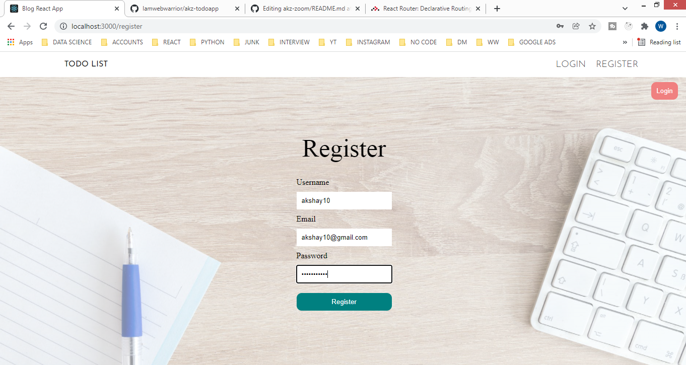
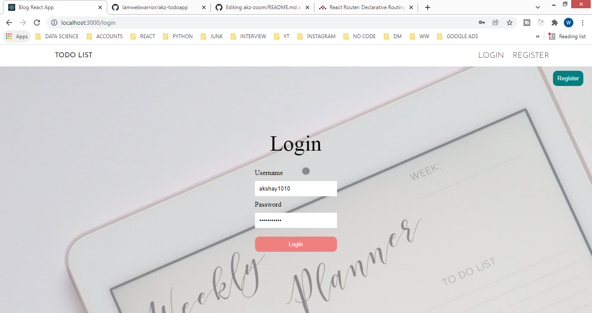
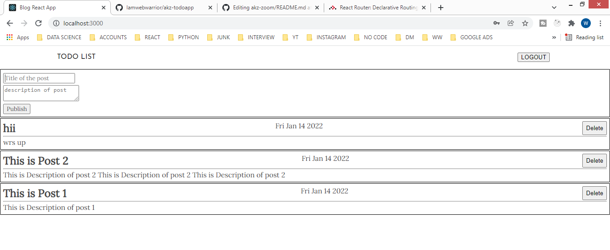

# TODO APP

sidebar with bottom tabs in react native
<br/>


step 5: click the link below to see demo<br/>
<div align="center">
<pre>
<a href="https://youtu.be/ql-RPRZpbCU">https://youtu.be/ql-RPRZpbCU</a>
</pre>
</div>


## Technologies Used In project are as follows

```
=======
#TECHNOLOGY USED

 "@react-navigation/drawer": "^6.3.1",
    "@react-navigation/material-bottom-tabs": "^6.1.1",
    "@react-navigation/native": "^6.0.8",
    "@react-navigation/stack": "^6.1.1",
    "expo": "~44.0.0",
    "expo-status-bar": "~1.2.0",
    "react": "17.0.1",
    "react-dom": "17.0.1",
    "react-native": "0.64.3",
    "react-native-paper": "^4.11.2",
    "react-native-reanimated": "~2.2.0",
    "react-native-vector-icons": "^9.1.0",
    "react-native-web": "0.17.1"

## SCREENSHOTS
==================
```



